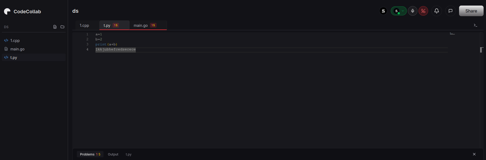
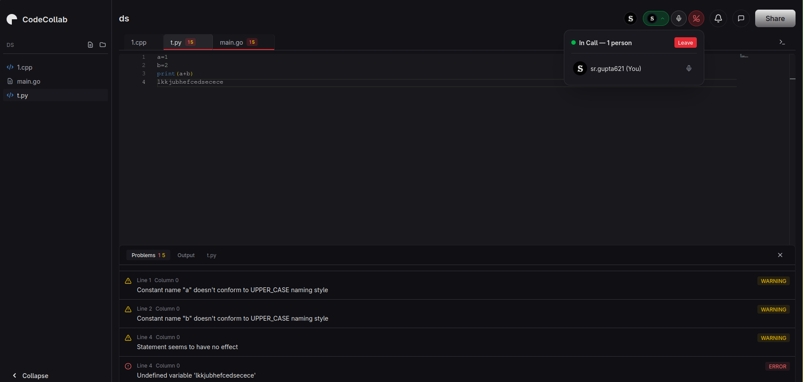
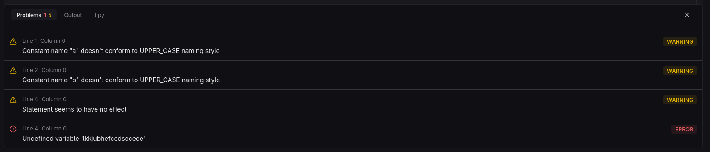

# Code Collab Backend

Real-time collaborative coding platform backend with voice calling support.

---

## Features

### 🖥️ Real-time Collaborative Code Editor

- Live synchronized code editing
- Multi-user cursors and selections
- File tree navigation
- Syntax highlighting support

### 📞 Integrated Voice Calling

- Peer-to-peer voice communication
- In-call controls
- Mute / Unmute functionality
- Participant list

### 🛠️ Error Tracking & Diagnostics

- Real-time syntax error detection
- Line number highlighting
- Error details and quick fixes
- Live compilation feedback

---

## Tech Stack

- **Backend:** Go 1.22+
- **Real-time:** WebSocket (Gorilla)
- **Observability:** Prometheus + Grafana + Loki
- **Documentation:** Swagger/OpenAPI
- **Containerization:** Docker & Docker Compose

---

## Getting Started

### Prerequisites
- Go 1.22 or higher
- Docker & Docker Compose
- Git

### Installation

1. Clone the repository:
```bash
git clone git@github.com:SRAYANSH-GUPTA/code-collab-backend.git
cd code-collab-backend
```

2. Install dependencies:
```bash
go mod download
```

3. Configure environment variables:
```bash
cp .env.example .env
# Edit .env with your configuration
```

4. Start services:
```bash
docker-compose up -d
```

5. Run the server:
```bash
go run main.go
```

Server will start on `http://localhost:8080`

---

## API Documentation

Swagger documentation available at:
`http://localhost:8080/swagger/index.html`

---

## Project Structure

```
code-collab-backend/
├── assets/         # Project screenshots & media
├── config/         # Configuration files
├── handlers/       # HTTP request handlers
├── middleware/     # HTTP middleware
├── models/         # Data models & structs
├── services/       # Business logic
├── utils/          # Utility functions
├── metrics/        # Prometheus metrics
├── docs/           # Documentation
└── main.go         # Application entry point
```

---

## Monitoring Stack

- **Prometheus:** `http://localhost:9090`
- **Grafana:** `http://localhost:3000`
- **Loki:** `http://localhost:3100`

---

## Contributing

1. Fork the repository
2. Create your feature branch
3. Commit your changes
4. Push to the branch
5. Open a Pull Request

---

## License

MIT License
